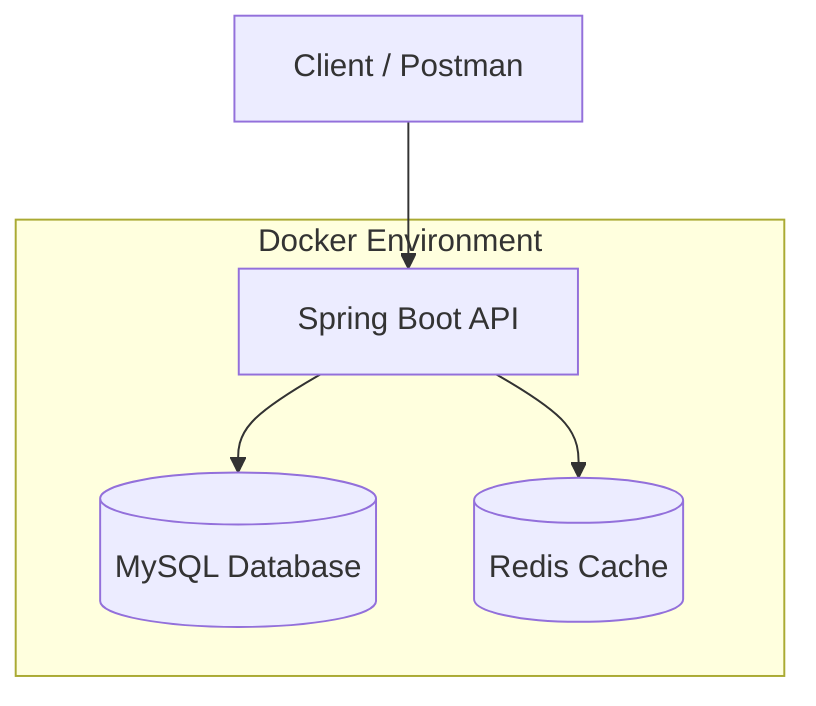

# Asset Management System API

Backend REST API for managing company assets, assignments, and maintenance using **Spring Boot**.

The system allows administrators to manage assets, technicians to handle maintenance tasks, and employees to view assigned assets.

---

# Architecture


---
# Tech Stack
### Backend
- Spring Boot
- Spring Security
- JWT Authentication
- Spring Data JPA

### Database
- MySQL

### Cache
- Redis

### DevOps
- Docker
- Docker Compose

### Tools
- Postman
- GitHub
---
# Features
### Authentication
- Register
- Login
- JWT Token Authentication

### Asset Management
- Create Asset
- View Asset
- Update Asset Status
- Delete Asset

### Asset Assignment
- Assign Asset to Employee
- View Assignment History
  
### Maintenance System
- Create Maintenance Request
- Technician Maintenance Queue
- Complete Maintenance

### Monitoring
- Dashboard Monitoring Summary
- Asset Status Tracking

---

# Database ERD


### Relationship
#### Role → Users
```
One Role
can have many Users
```
#### Users → Assignments
```
One User
can have many Assignments
```
#### Assets → Assignments
```
One Asset
can be assigned many times
```
#### Assets → Maintenance
```
One Asset
can have multiple maintenance records
```
---

## Business Flow

The Asset Management System manages company assets from creation, assignment, monitoring, and maintenance.


---

# Author
### Muhammad Arsyad Giri
### Backend Developer

---
